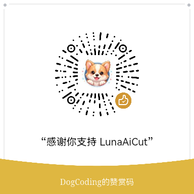

# Luna AI Cut

> 开源桌面素材管理与创作工具 —— 导入 · 整理 · 编辑 · 导出，一站完成

Luna AI Cut 是一款开源、非商业的桌面素材管理与创作工具。它将相机取片、本地媒体整理、AI 辅助选片、工作台编辑和批量导出整合到同一个流程中，并将持续扩展更多设备与素材来源。

> **项目声明**：Luna AI Cut 是个人开源研究项目，属于非官方软件，与 DJI（大疆）、Insta360 及其关联公司不存在任何关联、授权、合作或隶属关系。

## 下载

前往 [GitHub Releases](https://github.com/diamondfsd/luna-ai-cut/releases) 下载最新版本：

| 平台 | 格式 | 架构 |
|------|------|------|
| macOS | `.dmg` | Apple Silicon（M 系列芯片） |
| macOS | `.dmg` | Intel（x64） |
| Windows | `.exe` (NSIS) | x64 |

## 使用文档

- 产品介绍与使用指南：[https://luna.diamondfsd.com/](https://luna.diamondfsd.com/)

## 核心功能

- **多来源素材接入** — 支持从当前兼容相机或本地目录获取照片和视频，并将持续扩展更多设备接入能力
- **媒体浏览与批量整理** — 按日期浏览和筛选素材，支持预览、框选、批量下载与本地资源管理
- **AI 辅助选片** — 对完整照片和视频素材进行分析与分组，帮助快速找到更值得保留的内容
- **照片与视频编辑** — 在工作台中完成裁剪、视频分段、调色、HSL、曲线、LUT、边框与创意效果
- **智能与手动蒙版** — 识别人物、天空、水面和主体等区域，也可使用画笔、形状与渐变精细调整，视频支持蒙版跟踪
- **滤镜与水印** — 使用内置或自定义 LUT 滤镜，按分组管理；支持内置与自定义水印
- **灵活导出** — 支持批量导出、视频片段分别导出、Live Photo 与导出任务进度管理

当前部分相机连接、色彩还原和设备水印能力会因机型而异。项目会在验证兼容性后逐步增加支持范围。

## DJI 协议参考

DJI Osmo Pocket 4 / Pocket 4P 的设备识别、BLE 配对与 Wi-Fi 信息交互、TCP/UDP 会话以及媒体清单协议，参考了 [KonradIT/osmosis](https://github.com/KonradIT/osmosis) 项目的协议分析与实现。

Osmosis 是一个独立的开源 DJI Osmo 媒体客户端，采用 MIT License。Luna AI Cut 的 DJI 接入代码根据上游公开资料在 Electron/TypeScript 中重新实现，不依赖 DJI 官方 SDK。感谢 [KonradIT](https://github.com/KonradIT) 对 DJI Osmo 协议的整理和开源。

多设备媒体接入、可选 BLE/Wi-Fi 连接准备以及 Pocket 4 / Pocket 4P Mock 验收流程见 [`docs/camera-media-architecture.md`](docs/camera-media-architecture.md)。

## 开发指南

### 环境要求

- Node.js >= 22
- pnpm

### 快速开始

```bash
# 1. 安装依赖
pnpm install

# 2. 启动开发服务器（Vite + 热更新）
pnpm dev
```

### 常用命令

| 命令 | 说明 |
|------|------|
| `pnpm dev` | 启动 Vite 开发服务器（支持热更新） |
| `pnpm build:app` | 仅构建前端（tsc + vite build） |
| `pnpm build` | 完整构建（tsc + vite build + electron-builder 打包） |
| `pnpm pack:mac:arm64` | 打包 macOS ARM64 DMG |
| `pnpm pack:mac:x64` | 打包 macOS x64 DMG |
| `pnpm pack:win:x64` | 打包 Windows x64 NSIS |
| `pnpm pack:all` | 同时打包 macOS 和 Windows |
| `pnpm lint` | ESLint 代码检查 |
| `pnpm mock:luna` | 启动模拟 Luna 相机服务器 |
| `pnpm preview` | 预览构建产物 |

### 项目结构

```
luna-ai-cut/
├── src/                  # 前端源码（React + TypeScript）
│   ├── ui/               # 共享 UI 组件层（Button、Dialog、Tabs 等）
│   ├── components/       # 功能组件
│   ├── pages/            # 页面组件
│   ├── context/          # React Context
│   ├── styles/           # 全局样式与设计令牌
│   ├── lib/              # 工具函数
│   └── shared/           # 共享类型定义
├── electron/             # Electron 主进程
│   ├── main.ts           # 主进程入口
│   └── preload.ts        # preload 脚本（contextBridge）
├── landing/              # 产品介绍页（GitHub Pages 部署）
├── luna_mock_server/     # 模拟 Luna 相机服务器
├── scripts/              # 构建脚本
├── build/                # 应用图标
├── public/               # 静态资源
├── dist/                 # Vite 构建产物
├── dist-electron/        # Electron 构建产物
└── release/              # 打包产物输出目录
```

### 技术栈

| 类别 | 选型 |
|------|------|
| 框架 | React 18 + TypeScript |
| 构建 | Vite 5 |
| 桌面 | Electron 30 |
| UI 基元 | @radix-ui（Dialog / Tabs / Popover / Switch / Tooltip） |
| 图标 | lucide-react |
| 路由 | React Router（HashRouter） |
| 媒体解析 | exifr |
| 打包 | electron-builder |

### Electron 配置

- 主进程入口：`electron/main.ts`
- Preload 脚本：`electron/preload.ts`
- 构建产物：`dist-electron/`
- 图标文件：`build/` 目录（icon.icns / icon.ico / icon.png）
- 打包产物：`release/`

## License

MIT © [diamondfsd](https://github.com/diamondfsd)

## 支持项目

Luna AI Cut 目前由个人利用业余时间开发和维护。

如果它为你节省了时间，欢迎自愿支持项目持续更新。

赞助不会影响软件的正常使用，也不代表购买功能或技术服务。

<p align="center">
  <strong>微信赞赏</strong><br /><br />
  
</p>

不方便赞助也没关系。提交 Bug、分享软件、参与测试、给项目点一个 Star，都是对项目很大的帮助。

---

> 本项目为个人开源研究项目，属于非官方软件，与 DJI（大疆）、Insta360 及其关联公司不存在任何关联、授权、合作或隶属关系。DJI、大疆和 Insta360 均为其各自权利人的商标。
