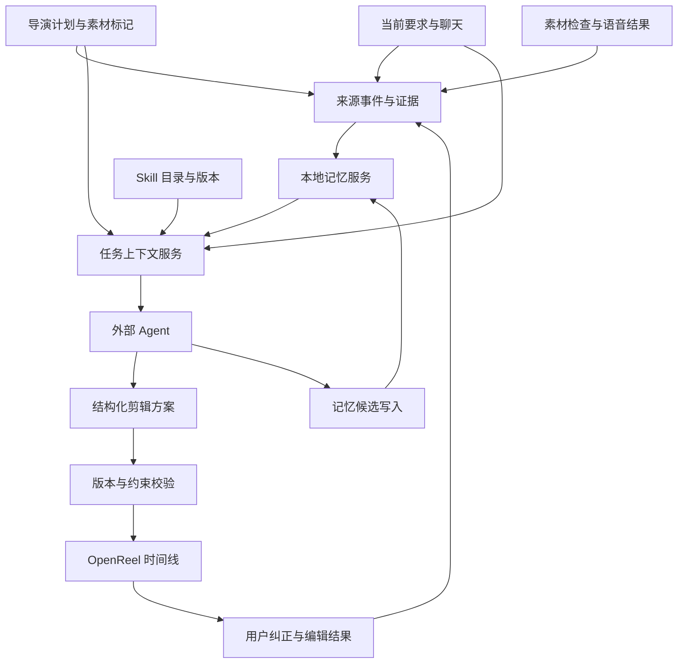

# AI 剪辑：导演计划、可组合 Skill 与记忆架构

日期：2026-10-02。状态：分阶段实现。导演计划编写、按计划剪辑与记忆使用 Skill 已加入；本地计划格式读取、列表/详情、Markdown 校验与创建、按 ID 校验和修改的七个接口已实现。应用级记忆首版已实现，当前契约、个人空间位置与限制以 [应用记忆架构](app-memory-architecture.md) 为准；本文中的剪辑上下文、导演剪辑方案应用及扩展计划管理仍待实现。下文早期记忆方案是扩展规划，不是已提供工具清单。

从页面入口到预览、修改和视频导出的用户流程见 [全链路流程](director-plan-ai-editing-workflow.md)。

## 1. 目标与架构决策

让外部 Agent 组合剪辑方法、场景风格、用户偏好和素材证据，生成符合当前要求的可编辑成片。导演计划减少搜索空间、明确故事目的，但不假设粗拍素材已具备计划描述的内容。

三类信息保持独立：Skill 是可复用的方法；记忆是有来源、有适用范围的历史信息；当前任务是本次授权与目标。不能把个人偏好硬编码进公共 Skill，也不能把历史记忆当成当前命令。

Luna 主进程管理上下文、持久化、版本和约束，外部 Agent 负责理解、分析和提出方案，OpenReel 负责编辑与呈现。保留现有 HTTP / MCP 工具入口和任务会话，不另外建立 Agent 宿主。

## 2. 当前基础与缺口

- `luna-editing-skill.ts` 通过 glob 自动发现内置 Skill 和 references，已有清单、正文和引用读取工具。
- `luna-core` 提供素材证据、会话版本、时间线验证与用户发起导出的通用契约；旅行、访谈、科技宣传、短视频、照片回忆和卡点已有场景 Skill。
- 导演计划具有 plan/shot/take 标识、顺序、属性、时长、选取范围和标记，存储清单包含素材相对路径。当前复制提示词将标记视为参考，尚无计划绑定与应用级约束执行。
- 素材目录已有稳定短编号，但不能替代跨移动、替换的内容身份。
- Agent 会话已有 revision、取消和过期要求拦截，但内存会话与工具事件不是长期记忆。
- OpenReel 聊天历史存在浏览器本地存储，最多 30 个对话、每个 100 条消息，并压缩工具结果。不能将它当成完整、永久、可验证的记忆证据库。
- 外部 Agent 自身窗口内的聊天目前不归 Luna 所有。不能声称已获取；需要 Agent 显式提交摘要/消息来源，标为外部声明，或者让用户在 Luna 中提供原话。

## 3. Skill 组合与扩展

### 能力维度

| 维度 | 作用 | 当前或示例 |
|---|---|---|
| 核心契约 | 会话、证据、写入、导出 | luna-core |
| 剪辑方法 | 计划编写与已有输入处理 | director-plan-authoring、director-plan-editing、editing-memory |
| 内容场景 | 故事结构与覆盖 | travel-vlog-story、talking-head-interview |
| 成片风格 | 节奏、包装与声音 | cinematic-photo-memory、product-tech-promo |
| 专项能力 | 某一阶段的处理 | music-beat-sync、字幕与声音能力可后续增加 |

维度是选择模型，现有 Skill 可以跨维度，不必立即重写所有目录。当前采用 frontmatter name/description 和自动发现；下一阶段可扩展 `kind`、`tags`、`version`、`requiredTools`、`compatibleWith`、`conflictsWith`，旧文件使用兼容默认值。工具能力以运行时目录为准。

选择流程：先读清单；始终加载核心；按输入选方法；按要求和适用偏好选场景/风格；进入音乐、字幕等阶段再加载专项内容。没有固定“最多三个”限制，但只加载本阶段需要的正文与引用，避免整库灌入上下文。

示例：导演计划下的轻快露营片 = 核心 + 导演计划 + 旅行故事 + 记忆（有适用偏好时）+ 卡点（音乐驱动时）。导演计划下的安静纪实片则不必加载卡点，风格不能自动覆盖镜头锁定。

优先级：当前明确要求/锁定 > 当前项目明确决策 > 适用的用户明确偏好 > 推断偏好 > 场景风格默认值。执行权限和文件安全契约始终有效；同级相互矛盾时返回冲突，不按 Skill 加载顺序覆盖。

扩展来源分内置与用户安装。第一版先使用内置；后续用户 Skill 通过显式安装进入独立目录，记录版本、摘要和来源，不让记忆写入工具安装或改写 Skill。资源路径白名单、防目录穿越、同名冲突和卸载均由目录服务处理。Skill 读取是文本上下文，不自动执行其中的脚本或取得额外权限。

## 4. 导演计划上下文与组内分析

### 4.1 外部 AI 编写与修改计划

完整链路支持两种入口：拍摄前从目标生成计划，用户按镜头拍摄/归组后剪辑；拍摄后先检查已有素材，再生成基于真实覆盖的计划与素材分配建议。第二种必须区别“已拍到”和“建议补拍”，不能只凭标题编造覆盖。

Markdown 是人和 Agent 之间可复制、可导入的创作载体；主进程里的结构化计划是持久化与编辑的权威对象。Agent 不直接修改 manifest/README，也不新增一套计划数据库。计划源于用户、手机或 AI 都使用同一领域服务。

当前导入支持 `# 标题`、首镜头前的 `主要内容：`、`## 01 镜头名称`、画面说明/景别/运镜说明/建议时长/备注。正文不能包含额外二级标题或外层说明；导入会生成新的 planId/shotId，已有计划的导入入口只追加镜头。它不是稳定 ID 的更新协议。格式细节作为 director-plan-authoring 的按需 reference 提供，工具还需返回 formatVersion 与限制。

新建路径：读取格式 → 生成 Markdown → 调用只读解析/校验 → 检查规范化结果与警告 → 按当前任务明确的创建要求提交。只要求“给个方案”时返回草稿，不自动保存或生成时间线。提交使用幂等键，服务分配 ID 并记录 generatedBy、sourceRefs、loadedSkillVersions；重复请求不能创建多个计划。

修改路径：读取当前计划与 expectedSnapshot → 返回按 shotId 定位的操作 → 验证影响 → 在领域服务写锁内提交。支持 set_plan_fields、add_shot、update_shot、reorder_shots 和 archive_shot；新增 ID 由服务分配。重命名/重排保留 takes、标记和本地文件关联，目录调整仍走现有存储服务。禁止按同名或序号推断镜头身份，禁止整份重新导入作为覆盖更新。

镜头删除默认归档，已有 takes 不删除；拆分/合并需要显式的 takeId 分配方案，未分配素材保留在原归档镜头。第一版可暂不开放自动拆并。普通计划编辑不得同时删除素材文件、触发远端同步或重写已有时间线；这些属于独立任务和权限。

同一变更跨手机/本地时沿用现有 pending/synced 签名与冲突策略，不把本地修改误当远端已同步。受影响的镜头方案/计划上下文失效，但内容相同的源素材观察仍可复用。已有剪辑标记“计划已改变”，由后续明确重剪要求重新绑定，不直接覆盖用户编辑。

任务契约增加 taskKind（plan-authoring / plan-revision / editing）与可选 planRef，让没有 projectId、没有素材的计划任务也能进入外部 Agent 会话。计划任务的结果返回 planId/planSnapshot 或 draft，而非伪造 projectId；不能只上报“剪辑完成”。会话 gate 按任务类型开放操作，不让计划任务顺带导出或修改无关项目。

计划管理工具如下，统一复用现有 HTTP/MCP 连接、会话 revision 和错误契约。前六行列出的七个本地工具已实现；导出 Markdown 与进一步管理能力仍为设计。第一版实际写入协议使用 changes 字段（字段修改、追加与排序），不支持归档或拆并，调用示例见全链路文档第 12 节。

| 工具 | 关键入参 | 结果与边界 |
|---|---|---|
| get_director_plan_format | 可选版本 | 规范 Markdown 模板、字段、限制、formatVersion 与支持操作 |
| list_director_plans / get_director_plan | 授权范围、planId | 可检索摘要或完整计划，含稳定 shotId 与快照 |
| validate_director_plan_markdown | markdown、formatVersion | 规范化草稿、总建议时长与 warnings，不分配持久 ID、不写盘 |
| create_director_plan | sessionId、revision、markdown、formatVersion、幂等键 | 本地计划与稳定 ID；不导入素材、不自动同步或创建时间线 |
| validate_director_plan_changes | planId、expectedSnapshot、operations | 结构/时长/素材关联影响与冲突；只读 |
| update_director_plan | sessionId、revision、planId、expectedSnapshot、operations、幂等键 | 保留关联的新版本；写前重新校验 |
| export_director_plan_markdown | planId、snapshot | 可供人阅读/重新创建的 Markdown，并注明不能原样用于 ID 保留更新 |

校验要包裹当前宽松 parser，不能把 parser 无报错当成符合格式：额外正文、字段落入备注、时长默认/钳制、目标总时长偏差都应返回警告；格式不支持的锁或素材关联字段不得假装生效。不要为了 API 严格校验改变历史导入兼容性。限制继续以 UTF-8 字节与现有字段上限为准。

计划记忆区分 AI 提议、用户接受、执行版本和素材观察。保存“为什么这样安排”的简述与来源，便于后续迭代；Agent 自己生成的风格不能自动成为用户偏好。针对用户明确纠正的方案可提出候选偏好，按记忆服务来源规则处理。

### 4.2 计划绑定与剪辑

任务绑定 planId、计划快照摘要、projectId 和 requestRevision；按 shotId/takeId 解析真实本地文件，并映射现有 mediaId。路径解析必须限于授权素材目录且检查实际文件，不信任清单的任意相对路径或 available 标志。

区分意图（希望拍到什么）、观察（实际识别到什么）和选择（最终用了什么）。一个计划镜头可落成多个时间线片段，但每段保留来源关联。

默认：组内选材、计划顺序、时长作为目标、已有范围优先参考。新增明确的顺序锁、范围锁和必选设置，不改变历史 selected_range 的语义。缺镜头或时长不兼容时返回问题，不自动串组补齐。

分析分层：标记范围/组内候选低成本概览 → 相关动作或语音定位 → 候选区间细查 → 精确起止点与前后衔接。长视频即使归组也可能仍很昂贵；按覆盖和置信度扩展采样，保留已检查区间，不因稀疏抽帧声称完整动作已验证。

分析记录包含：内容指纹、源时间区间、观察描述、动作阶段、质量问题、证据引用、覆盖区间、分析器/模型版本、置信度。置信度是辅助排序信息，不能单独决定事实或持久偏好。

结构化方案包含 planSnapshot、requestRevision、基准 timelineRevision、shotId、takeId、mediaId、sourceInMs/sourceOutMs、timelineStartMs、speed、trackRole、决策简述。范围全部为原素材毫秒；应用适配器集中转换编辑工具单位。

校验分硬错误与可接受提示：身份与版本、组归属、文件可用性、时长边界、锁、必选镜头、重叠、变速后时间和总时长。叙事质量与真实内容仍依赖证据，不能靠结构校验宣称成片质量达标。

应用方案先预检，使用 applicationId 幂等、项目级写锁和撤销检查点，保存执行日志。现有 batch_actions 不应被假定具有事务能力；部分失败返回已应用操作和恢复状态，绝不自动重复导入或整批覆盖。应用后读回时间线并验证；手工修改后拒绝旧基准版本，重新合并。导出继续沿用用户发起与应用确认。

## 5. 记忆分层

| 类型 | 范围与用途 | 例子 |
|---|---|---|
| 用户偏好 | 用户全局或场景限定，明确/推断分开 | 旅行片偏好自然色彩、少转场 |
| 项目决策 | 单个项目/任务，随版本演进 | 本片无音乐，保留完整现场对白 |
| 素材观察 | 按内容指纹与源区间复用 | 某段出现完整搭帐篷动作，但尾部遮挡 |
| 镜头方案 | 计划快照下的选材与编排理由 | 第二镜头用展开与插杆两个片段 |
| 结果反馈 | 对具体方案的评价与纠正 | 用户要求取消前三个转场 |
| 任务摘要 | 接续工作，记录已完成、未解决事项 | 初稿已完成，字幕尚未核对 |

不将“这次不要音乐”变成永久偏好；不将工具成功、导出、无投诉当成用户喜欢；手工剪短只证明用户改动，不能自动证明喜欢快节奏。素材内容和个人喜好采用不同更新与失效规则。

### 来源与学习

可用来源：Luna 聊天原文、任务要求修订、计划及标记、工具返回的实际证据、人工编辑差异、明确反馈、用户提供的参考材料、外部 Agent 主动提交的上下文。

来源事件由主进程分配 sourceId，保留 actor、projectId/sessionId、revision、时间和内容摘要。用户消息、工具证据与 Agent 声明分开标记。外部声明不能通过填写 actor=user 升级成已验证用户原话。

采集事件 → 选择相关证据 → Agent/可替换提取器提出记忆候选 → 服务校验来源、范围、幂等与冲突 → 写入候选或有效记忆。明确的长期用户原话可成为有效偏好；服务核对原文或用户确认，不能只接受 Agent 的 explicit 标签。推断偏好保持候选，重复支持可提高排序，但不自动变成用户确认。

第一版复用当前外部 Agent 做提取，不再默认启动第二个模型。需要自动提取时再提供可替换适配器；没有提取器时仍保存来源事件并支持人工/Agent 写入，剪辑不能被记忆提取失败阻塞。

### 记录模型

每条记录保存 `id/type/scope/key/value/status/version`、适用条件（场景、风格）、来源引用、createdAt/updatedAt、可选 expiresAt、supersedes、推断置信度。scope 明确区分 user/project/plan/media；planId 非全局唯一时加来源命名空间。来源片段按最小需要保留，不保存长篇内部推理。

status 为 candidate/active/superseded/invalidated/deleted。更新采用 expectedVersion；同一来源重复支持不能增加权重。用户新偏好替代旧偏好时保留版本关系；只针对一个项目的反例不删除全局偏好。

mediaId 是操作编号，内容指纹才是复用身份。先通过路径、大小、修改时间快速判定变化，再在复用前按内容哈希确认；哈希大文件在后台计算。文件替换、证据撤回或模型分析版本变化使相关记录失效；快路径不得当作内容一致的证明。

## 6. 持久化与模块边界

当前应用级记忆采用串行原子文件仓储和结构化文本检索；未来数据量增长时可替换为主进程 SQLite/全文索引，再按收益增加可替换向量索引。选择兼容当前 Electron 的驱动前单独验证三平台与打包，记忆设计不绑定某个驱动或 embedding 模型。

记忆固定保存到个人空间 `~/.luna-ai-cut/memory/`，不随 baseDir、项目目录或软件安装迁移/删除。与 `workspace-projects`、`ai-editor-projects` 和导演素材目录独立；重命名/删除项目不能误操作其他域。跨目录操作用事务日志协调，项目删除清理项目记忆及引用，全局偏好按来源保留规则处理。

主要表：source_events、memories、memory_sources、memory_revisions、analysis_artifacts、context_snapshots、tombstones、schema_migrations。来源和派生记录通过关联表查询，便于删除与失效；写入事务与唯一幂等键保证崩溃恢复和并发一致性。

模块建议：

- `electron/features/memory/`：repository、source ingestion、retrieval、write validation、lifecycle；不调用 renderer 存储。
- `electron/features/ai-editor-context/`：任务快照、Skill 推荐、计划/media 映射、上下文预算。
- `electron/features/ai-editor-director/`：约束规范化、方案校验与应用协调。
- `src/shared/types/`：版本化请求响应类型；preload/IPC/iframe bridge 仅暴露明确能力。
- 现有 HTTP/MCP：注册工具、认证、会话 gate、错误契约和审计，调用上述服务。
- OpenReel：将聊天/反馈事件送入主进程，消费上下文与方案，展示和修改记忆；不另建独立记忆数据库。

renderer 的 `mcp-listener.ts` 已超过 600 行，后续扩展前必须按职责拆分。此次计划操作直接走主进程，未向其增加职责；主进程原先过大的 HTTP 服务已拆为传输、协议、工具发现、会话工具与路由模块，计划 IPC 已提取共用 reader/writer。未在 renderer 中另建计划存储。

聊天历史可渐进导入，记录 importVersion 与 conversation/message ID 幂等去重，并标明被压缩或截断。服务必须先读取可靠来源再存记忆，不从压缩工具摘要恢复并不存在的画面证据。

## 7. 对外接口（现有契约与后续规划）

已实现的应用级记忆工具为 `search_memories`、`get_memory`、`save_memory`（含更正）、`forget_memory`。它们不要求 editing 流程，实时 schema 和当前限制见应用记忆架构。下面带 edit 前缀的记忆接口名是早期规划，不能作为当前工具名调用；镜头来源/上下文相关接口仍待实现。

统一通过现有 `POST /api/tools/{toolName}`，同时适配现有 MCP。GET /tools 的实时 schema 为准，不新增让 Agent 绕过会话直接写数据库的 REST 通道。

| 工具 | 关键入参 | 结果与规则 |
|---|---|---|
| get_edit_context | sessionId、revision、可选预算 | 当前要求、计划快照、推荐 Skill、适用记忆、缺口与 contextId |
| get_director_edit_context | sessionId、revision | 镜头、约束、候选 mediaId、标记及 planSnapshot |
| search_edit_memories | query、types、scope、limit、cursor | 有来源、状态、适用性、版本的摘要；范围由服务与任务交集决定 |
| get_edit_memory | memoryId、可选来源详情 | 记录正文与授权来源片段 |
| record_edit_context_source | sessionId、revision、外部上下文、幂等键 | 外部声明 sourceId；不伪装为本机用户消息 |
| save_edit_memory | sessionId、revision、类型、scope、内容、sourceRefs、幂等键 | 新记录 id/status/version；服务决定可否 active |
| update_edit_memory | memoryId、expectedVersion、sessionId、revision、变更与来源 | 新版本或冲突；不能篡改原来源 |
| forget_edit_memory | memoryId 或明确范围、expectedVersion、用户请求引用 | 逻辑撤回、来源依赖失效与索引清除；需可验证用户忘记请求 |
| validate_director_edit_plan | contextId、proposal、revision | errors/warnings/可执行状态；不写时间线 |
| apply_director_edit_plan | contextId、proposal、revision、timelineRevision、applicationId | 应用状态与 provenance；写前重新校验 |

所有修改走会话版本与取消 gate。读取也检查有效凭证和授权范围，不能因只读就向任意本机调用者公开全局记忆。全局偏好写入需要来源支持跨任务含义，项目任务不能任意修改其他项目。内置 Agent 和外部 Agent 共用服务与规则。

返回沿用 ok/summary/data/error，增加 MEMORY_VERSION_CONFLICT、MEMORY_DISABLED、SOURCE_UNVERIFIED、CONTEXT_STALE、PLAN_CONSTRAINT_CONFLICT 等精确错误。候选成功写入返回 ok=true/status=candidate，不能伪装成有效偏好。现有最多一次可修复重试规则仍适用。

## 8. 上下文检索与预算

优先结构过滤：当前项目/计划/媒体身份 → 适用场景与风格 → 明确偏好与有效记录 → 关键词/全文相关性、来源强度与新鲜度。首期不依赖向量搜索即可覆盖高价值场景。

get_edit_context 使用条数与 UTF-8 字节上限并返回 truncated、遗漏类别和详情读取入口；可估算 token 但不能宣称精确跨模型计数。只传摘要与引用，不灌入完整历史。Agent 再按当前阶段读取 Skill 正文和具体证据。

contextId 固化 requestRevision、planSnapshot、timelineRevision、memoryVersion 和 loadedSkillVersions。当前指令/计划/时间线/有效偏好变化使受影响上下文失效；分析候选或使用次数变化不应无意义打断剪辑。读取旧分析时对媒体指纹再校验。

材料中的文字、语音、参考文档、历史聊天和记忆内容均作为数据呈现，不能把其包含的命令当成系统指令或扩大操作权限。

## 9. 用户控制、遗忘与降级

提供记忆启停、偏好查看/修改/删除、项目记忆清理和“一键忘记”，文案保持简短。用户可继续剪辑而不启用长期记忆；本次任务必要状态不等于长期学习。

删除聊天来源时删除不必要原文、清除其派生支持；有其他合法来源的记忆重新评估，没有来源的记录失效。删除留下最小 tombstone 用于阻止旧导入/提取任务复活，不保留被删除正文。重新学习需要新的适用用户证据。索引、摘要、快照和分析附件同步清理。

数据库异常不能静默变成“没有偏好”，返回 degraded/unavailable 并继续不依赖记忆的剪辑。失败写入不阻塞时间线保存；旧版可识别的新 schema 不应被破坏性重建。备份与恢复沿用本地数据保护，恢复后重放遗忘 tombstone 并重建索引，避免重新暴露已删内容。

## 10. 分阶段落地与验收

1. **本次**：加入导演计划编写、按计划剪辑和记忆使用 Skill，更新方法/场景组合路由，形成架构文档。Skill 自动发现；新文件需下次正常构建后进入运行中的资源，本次不构建。
2. **上下文与记忆基础**：持久化/迁移、来源事件、聊天渐进导入、有限搜索与读写、版本和遗忘、最小偏好管理；此时无需向量库或额外模型。
3. **导演计划闭环**：先抽取共用计划领域服务，支持 Markdown 草稿校验/创建与按 ID 修订，再做计划绑定与 media 映射、组内分析记忆、方案校验、可恢复应用、时间线来源关联。
4. **持续个性化**：反馈候选提取、场景偏好与冲突处理、局部重剪、上下文预算；量化收益后再扩展安装 Skill 与向量检索。

必测风险：跨项目读取隔离、来源伪造、一次要求误晋升长期偏好、并发版本冲突、取消后的晚到写入、同来源重复计权、文件替换复用旧分析、删除及恢复后复活、数据库迁移/崩溃、计划过期应用、锁范围越界、部分应用恢复与用户编辑保护。优先纯服务与持久化测试；共享类型/IPC/bridge 改动需同步契约测试，构建和界面验收仅在明确授权时执行。

效果指标：重复识别减少的区间/时间、用户纠正次数、错误跨场景偏好应用次数、缺镜头检出、方案应用成功率与恢复成功率。不能用记忆条数或 Skill 数量替代成片质量。

计划编写接口必测：格式警告与时长规范化、创建幂等、同名镜头身份区分、重命名/重排后素材与标记保留、并发手机修改冲突、归档不删素材、计划修改不写时间线，以及计划任务不误报剪辑项目结果。
