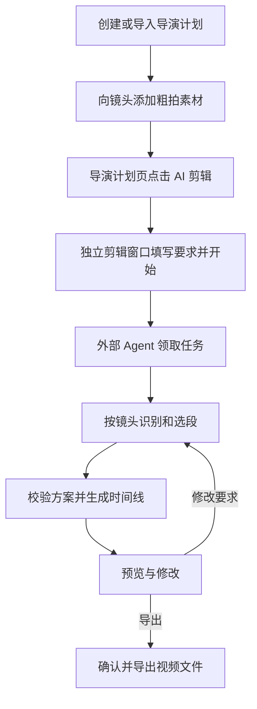

# 从导演计划到 AI 成片：全链路产品与实施流程

日期：2026-10-02。本文前半部分定义目标流程。外部 Agent 创建、读取和修改本地导演计划的接口已实现，实际调用方式见第 12 节；当前统一入口为导航栏「AI 助手」右侧浮窗，描述导演计划需求并在输入区选择 Agent 后发送，Agent 通过技能工具读取清单和全文，选择导演流程；首次消息和任务进度已本地存档。尚未实现一键绑定已有计划并发起剪辑，剪辑上下文、方案应用和记忆服务仍待实现。本文第 3 节描述未来计划到剪辑的交接，不代表当前新增页面入口。

底层接口与存储设计见 [架构方案](ai-editor-skills-memory-architecture.md)。本文以用户完成一条视频为主线，说明入口、任务交接、Agent 执行、预览修改和文件导出。

## 1. 用户看到的完整流程



用户只需准备计划和素材、给出剪辑要求、检查结果并导出。计划中的素材可以粗拍，用户不必先把每条视频裁成成品片段。

「时间线完成」与「视频文件已导出」是两个不同结果。默认先生成可编辑时间线；只有用户主动要求导出并在应用确认后，才产出视频文件。

## 2. 准备导演计划

计划可以来自用户手写、固定 Markdown 导入、外部 AI 生成，或外部 AI 根据已有素材提出。已有计划修改必须按稳定 shotId 更新，不重新导入整份文本覆盖。

每个镜头至少有名称、目的/画面说明和候选素材，建议时长用于指导节奏。画面说明是期望，实际内容需要 Agent 检查。用户可标记优先范围；明确锁定后才作为禁止越界的限制。

拍摄前生成的空计划可以保存，但不能直接完成剪辑。至少有可用本地素材时才能发起剪辑；镜头缺素材时提示缺失，用户可以补齐，或明确允许省略该镜头后继续。

第一版只使用已准备好的本地素材，不让发起剪辑自动触发下载、删除、手机同步或文件移动。远端素材沿用现有同步/下载入口准备好后再开始。

## 3. 导演计划页的入口

在当前计划操作区新增主操作「AI 剪辑」，保留「AI 提示词」作为手动交接方式，两者不等同。

点击「AI 剪辑」时：

1. 等待当前计划本地编辑保存，获取最新计划签名。
2. 检查素材存在性、可读取性和镜头归属；报告缺失，不相信清单 available 字段就直接继续。
3. 创建一个持久的剪辑草稿任务，绑定 planId、来源命名空间和 planSnapshot。
4. 打开独立 AI 剪辑窗口，显示该草稿的要求输入与计划摘要。此时尚未派发 Agent 任务，也不因打开窗口就导出或改写现有项目。

第二次点击同一草稿聚焦已有窗口，不重载页面丢失聊天或创建重复项目。如果已有其他任务运行，展示该任务，不能静默替换；用户可停止它或稍后开始。

该入口需扩展现有 openWindow 契约，例如接受 `directorTaskDraftId`，不能只把所有素材扁平化为 assets。镜头—素材关系由主进程解析，renderer 不传任意路径让服务信任。

## 4. 剪辑窗口中的任务确认

显示精简计划摘要：计划名称、镜头数和可用素材数；提供「剪辑要求」输入、必要的时长/比例设置和「开始剪辑」。不把 Skill、模型或内部字段塞进普通用户操作流程。

示例要求：“剪成约 45 秒的轻快露营短片，少用转场，保留搭帐篷的现场声音。”

没有填写的选项使用项目默认值或适用偏好。明确要求与计划锁定冲突时先解决冲突；不能为了达到 45 秒自动截断必保留对白。

点击「开始剪辑」才提交任务。服务生成 sessionId/revision，固化当前计划与要求，任务进入等待状态。用户无须复制目录、清单或手工创建 OpenReel 项目。

## 5. 外部 Agent 如何接上任务

HTTP 服务不是模型，也不会自行启动任意外部 AI。第一版沿用现有外部 Agent 连接流程：用户将 HTTP 连接提示词交给外部 Agent，它读取 `/skill`、发现 `/tools` 并等待任务。已连接并等待的 Agent 可以直接领取新任务。

没有 Agent 领取时，应用显示等待状态并提供已有连接方式；不能显示“正在分析”。后续若增加自动启动 Agent，必须作为独立连接器实现，不能假设任意外部聊天窗口都能被 Luna 调用。

Agent 使用现有 `wait_for_edit_request` 领取任务，返回值需扩展为包含 taskKind、directorTaskDraftId/planRef 与 contextId，保留现有 sessionId/revision。任务来自外部聊天时，`start_edit_session` 也需支持同样的 planRef，并验证目标计划存在和授权范围。

当前上述计划字段尚未实现；仅把计划名称写进 request 文本不能替代可靠绑定。

## 6. Agent 执行顺序

下表区分已存在的工具与拟议工具；所有名称和参数最终以运行时工具目录为准。

| 阶段 | Agent 行为 | 能力状态 |
|---|---|---|
| 领取任务 | wait_for_edit_request，读取最新要求及 revision | 会话已有；计划绑定待扩展 |
| 获取上下文 | get_edit_context / get_director_edit_context，取得镜头、素材映射、约束和适用记忆 | 拟议 |
| 组合能力 | list_editing_skills、get_editing_skill，读取核心、导演剪辑、适用场景；按需读取记忆/卡点 Skill | 已有；新增 Skill 下次构建后可用 |
| 检查素材 | list_local_media、inspect_local_media、create_media_contact_sheet、get_local_media_metadata；对白按需 transcribe_local_media | 已有 |
| 复用分析 | 查询有效记忆；只补查未覆盖或不确定区间 | 记忆工具拟议 |
| 提出剪辑方案 | 每段指定 shotId/takeId/mediaId、源范围、时间线位置和选择原因 | 结构化协议拟议 |
| 校验方案 | validate_director_edit_plan 检查归属、范围、顺序、时长与版本 | 拟议 |
| 准备项目 | 校验通过后由应用建立/绑定 AI 剪辑项目；复用现有素材导入任务并等待终态 | 项目/导入已有；协调器拟议 |
| 生成时间线 | apply_director_edit_plan 应用方案，保留来源与恢复检查点 | 拟议；底层编辑工具已有 |
| 风格处理 | 按要求处理音乐、声音、字幕与包装；卡点用真实节拍，再校验约束 | 现有编辑工具；统一计划约束复检待实现 |
| 完成 | 读回时间线确认实际状态，report_edit_result 返回可预览项目 | 已有；计划结果关联待扩展 |

Agent 先在镜头内部粗看，再细查候选区间。优先有用标记，逐步扩大到同组其他片段；不跨镜头偷换素材。一个计划镜头可组合几个互补动作段，避免只是按目录顺序拼接整条粗拍视频。

例：搭帐篷镜头有五条视频，选展开、插杆、固定三个动作，跳过等待和重复失败片段。如果没有完成画面，报告缺口，不声称“搭建完成”已被拍到。

新项目只在方案可执行后创建；后续失败保留已成功导入的素材与恢复状态，不循环创建空项目。现有导入每批最多 50 项，按真实 jobId 查询，禁止超时后重复整批提交。

## 7. 完成后的预览和修改

任务完成后，剪辑窗口打开对应项目，用户可播放、查看镜头片段并手工编辑。计划页保存 planId → projectId 的结果关联，提供「打开剪辑」，不以计划名称查找项目。

用户可直接说：“第二个镜头太拖，缩短一点；日落多停留两秒。”

新要求进入新任务或更新仍在运行的任务 revision；Agent 获取最新时间线和要求，通过片段 provenance 定位相关 shotId。只改受影响部分，保留其他镜头、手工编辑和锁定内容。无法可靠定位时读取当前状态或澄清，不整片重建。

计划随后发生变化时，提示当前剪辑来自旧计划。修改计划不立即改时间线；用户明确要求按新计划重剪才重新绑定。旧方案不得覆盖新计划或新的人工时间线版本。

## 8. 导出成片

用户预览后点击「导出」或明确要求 Agent 导出。手动导出沿用现有编辑器能力；Agent 导出沿用当前会话要求检查与应用确认。

Agent 路径：获取最新要求 → 检查时间线与适用导出设置 → 调用 export_video → 用户在 Luna 确认 → 实际导出 → 工具成功返回真实文件路径 → report_edit_result 记录导出结果。

用户一开始明确要求“剪辑并导出”时，可以在时间线检查后进入导出确认；仍不能跳过应用确认。拒绝、取消、超时或失败只保留项目，不能报告已生成视频文件。

结果关联记录项目 ID、计划快照、任务 ID、方案版本和可选导出路径。文件被移动或删除后，项目仍可打开，不能依赖旧路径存在来判断项目是否完成。

## 9. 贯穿流程的记忆

开始时只读取与当前场景/计划/项目/素材有关的记忆；当前明确要求覆盖历史偏好。分析后保存有证据的源片段观察；完成后保存采用方案和待解决缺口；用户纠正后记录反馈及可用偏好候选。

“这次不要音乐”保存在当前项目。“以后旅行片少用转场”有明确原话才成为旅行场景偏好。导出成功不能证明用户喜欢所有剪辑决定。记忆不可用时允许继续剪辑，不阻塞项目保存。

## 10. 异常与恢复

| 情况 | 必须行为 |
|---|---|
| 无本地素材 | 停留在准备阶段，不派发无法完成的任务 |
| 部分镜头缺素材/不符合描述 | 标出缺口，由用户补齐或明确允许调整 |
| 没有 Agent | 保持等待；取消后晚到领取无效 |
| 导入部分失败 | 保留成功项，按失败项处理，不重复整批导入 |
| 计划或要求变化 | 旧 proposal/context 失效，重新读取；不继续旧写入 |
| 用户停止 | 后续修改被 gate 拦截，保留已保存项目并说明部分完成 |
| 应用方案部分失败 | 根据执行日志恢复或返回部分完成状态，不声称事务成功 |
| 应用/Agent 重启 | 重新读取持久草稿、项目与应用日志；创建新会话接续，不复活旧内存 sessionId |
| 导出失败 | 保留可编辑项目，明确无成功成片文件 |

## 11. 实施清单与完成标准

1. 抽取可复用计划领域服务，提供格式读取、草稿校验、创建和 ID 保留修改工具，使 AI 能准备计划。
2. 实现导演计划页「AI 剪辑」、持久草稿、独立窗口上下文交接与去重，扩展会话 planRef。删除单靠 prompt 文本猜计划的依赖。
3. 实现 plan/shot/take → media 映射、快照上下文和约束校验；接入组内识别与必要 Skill。
4. 实现可恢复的方案应用、项目/计划结果关联和片段 provenance；支持预览与局部修改。
5. 接入有限记忆搜索/保存，并完成既有用户发起导出的结果闭环。记忆可降级，不应成为首次剪辑的前置依赖。

全链路完成标准：用户从一份有本地粗拍素材的计划点击入口，外部 Agent 领取后按计划选段，产生可重开的项目；用户修改一个镜头不破坏其他编辑；明确导出并确认后得到可播放的视频文件。素材不串组、锁定不越界、缺口可见、过期写入被拦截、失败可恢复。

默认用纯服务和持久化测试验证契约。构建、Electron 行为回归和最终播放验收在用户明确授权的里程碑执行；计划管理实现采用非界面验证，本次不启动应用或构建。

## 12. 已实现：让外部 Agent 创建与修改计划

以下为当前源码已实现的接口。使用更新后的应用与现有 HTTP 连接提示词；服务只在应用运行时可用，Agent 从固定发现文件读取最新端口，通过 list_agent_skills/get_agent_skill 读取适用指引。无需先创建剪辑项目或打开编辑窗口。会话支持 `purpose=director-plan`；独立的计划 planRef 与结构化结果字段仍未实现。

所有调用使用 `POST /api/tools/{toolName}`，请求体为 `{ "arguments": { ... } }`。同一组工具也可通过既有 MCP 入口调用。先通过 `/tools` 发现并调用 list_agent_skills/get_agent_skill，以实时 schema 为准；HTTP 200 不代表业务成功。

### 创建计划

1. `get_director_plan_format`：读取固定格式与限制。
2. `validate_director_plan_markdown`：传入 `formatVersion: 1` 和 Markdown，检查返回 draft、totalDurationMs 与 warnings。只要求建议时到这里即可，不写盘。
3. 用户要求保存时，优先通过 `wait_for_edit_request` 领取 Luna 创建的导演计划任务并核对交接编号；任务直接来自外部对话时调用 `start_edit_session`，传入 `purpose=director-plan`、用户原话和真实 Agent 身份，取得 sessionId/revision。
4. `create_director_plan`：传入上述会话、Markdown、formatVersion 与唯一 idempotencyKey，返回 planId、snapshot、稳定 shotId 和 created。
5. 调用 `report_edit_result` 报告 completed，summary 包含计划编号；不填写不存在的 projectId，不声称已经剪出视频。

创建请求示例（sessionId 必须替换为实际返回值）：

```json
{
  "arguments": {
    "sessionId": "实际会话编号",
    "revision": 1,
    "idempotencyKey": "此次创建的唯一操作编号",
    "formatVersion": 1,
    "markdown": "# 露营短片\n主要内容：自然记录\n\n## 01 抵达\n画面说明：人物进入营地\n景别：远景\n运镜说明：固定机位\n建议时长：4 秒\n\n## 02 搭建\n画面说明：展开帐篷与插杆\n建议时长：8 秒\n"
  }
}
```

计划写入现有导演计划目录，用户可在导演计划页刷新查看。不会自动下载、分配素材、同步手机或生成时间线。创建键持久化，重复相同请求返回已有计划，created=false；同一键不同内容返回 IDEMPOTENCY_CONFLICT。

### 读取与修改

1. `list_director_plans`：可传 limit（1–100）与 offset；返回 total、nextOffset 和摘要。
2. `get_director_plan`：传 planId，返回当前 snapshot、镜头编号、属性和素材摘要；不暴露本地路径。
3. `validate_director_plan_changes`：传 planId、expectedSnapshot、changes，得到修改预览，persisted=false；不写盘。
4. `update_director_plan`：传相同变更和读取时的 expectedSnapshot，加当前 sessionId/revision 与新的 idempotencyKey。应用在写锁内重新检查版本，保留素材、范围、标记和同步待办。
5. 读取返回结果，完成任务上报。修改后获得新 snapshot；下一次修改使用它。

修改请求示例：

```json
{
  "arguments": {
    "sessionId": "实际会话编号",
    "revision": 1,
    "idempotencyKey": "此次修改的唯一操作编号",
    "planId": "实际计划编号",
    "expectedSnapshot": "get_director_plan 返回的 snapshot",
    "changes": {
      "mainContent": "节奏轻快，保留现场声音",
      "shots": [
        { "shotId": "实际镜头编号", "name": "搭建帐篷", "content": "展开、插杆、固定和完成状态", "durationMs": 10000 }
      ]
    }
  }
}
```

changes 可修改 title/mainContent，以及镜头 name/content/framing/movement/remark/durationMs。appendMarkdown 追加新镜头并分配 ID；添加后重新读取，再用包含全部 shotId 的 shotOrder 排序。第一版不开放删除、拆并、素材迁移或标记修改。

PLAN_VERSION_CONFLICT 表示计划已变化，重新读取并重算修改，不能强行覆盖。REQUEST_UPDATED / USER_STOPPED 拦截过期或取消任务。极端情况下，重排同名镜头会让旧目录对应另一份素材，此时返回 PLAN_MEDIA_COLLISION，需先调整镜头名称再重排，避免覆盖素材。

最新更新的重复请求识别记录也随计划持久化；更早的更新由快照保护，不提供无限历史操作重放。取消在提交前生效，已提交操作不会被自动回滚；保存以 manifest 为权威，README 为派生说明。记忆与计划到剪辑的按钮链路不属于这一步的交付。
